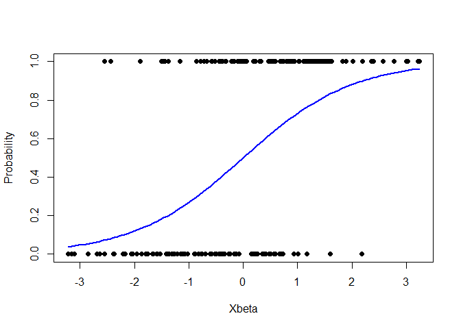
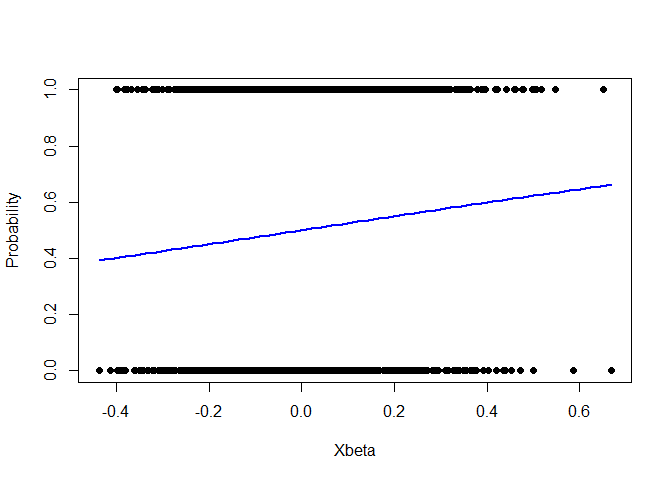

# Packages for Logistics regression

The package must contain the basic functions to perform logistic
regression (e.g. estimate the coefficient vector β

which includes the independent variables/predictors plus the intercept)
and obtain different outputs from the procedure. The estimator to be
computed using numerical optimization is the following:

$$
\hat{\beta} := \arg\min_\beta \sum_{i=1}^n \left( -y_i \cdot \ln(p_i) - (1 - y_i) \cdot \ln(1 - p_i) \right),
$$ where $$
p_i := \frac{1}{1 + \exp(-x_i^T \beta)},
$$ and $y_i$ and $x_i$ represent the $i$-th observation and row of the
response and the predictors respectively.

The package is specifically designed to perform logistic regression
using numerical optimization techniques. This package offers a suite of
essential functions that enable users to execute logistic regression
analysis and extract various key outputs from the process. The core
functionalities include:

    Calculation of Initial Values for Optimization: Leveraging the least-squares method to provide starting points for the logistic regression optimization process.
    Bootstrap Confidence Intervals: Functionality to generate bootstrap samples and calculate confidence intervals, enhancing the robustness of the regression analysis.
    Logistic Curve Plotting: Tools to visualize the logistic regression curve, offering intuitive insights into the relationship between variables.
    Confusion Matrix Generation: Enables the construction of a confusion matrix, which is pivotal in evaluating the performance of the logistic regression model.
    Performance Metrics Computation: The package computes a range of performance metrics critical for assessing the efficacy of the logistic model. These include:
        Prevalence: Measures the proportion of the response variable in the dataset.
        Accuracy: Quantifies the overall correctness of the model.
        Sensitivity: Assesses the model's ability to correctly identify true positives.
        Specificity: Evaluates the model's accuracy in identifying true negatives.
        False Discovery Rate: Determines the proportion of false positives in the predicted positives.
        Diagnostic Odds Ratio: Offers a measure of the effectiveness of the logistic regression model.

Below are descriptions for each of the functions in package. These
descriptions provide an overview of what each function does, its
parameters, and its return value.

**bootstrap_conf_intervals(X, y)**

Description: Calculates bootstrap confidence intervals for logistic
regression coefficients. This function employs bootstrap sampling to
estimate the variability of the coefficient estimates, providing a range
of plausible values for each coefficient.

Parameters:

    X: Matrix of predictors.
    Y: Binary response variable (0 or 1).

Returns: Matrix of bootstrap confidence intervals for each coefficient.

**plot_logistic_curve(X, beta_hat, y)**

Description: Plots the logistic regression curve. This visualization
helps in assessing the fit of the logistic regression model to the
observed data.

Parameters:

    X: Matrix of predictors.
    beta_hat: Estimated coefficients from the logistic regression.
    y: Binary response variable (0 or 1).

Returns: A plot of the logistic curve against the data.

**confusion_matrix(X, y, beta_hat)**

Description: Generates a confusion matrix for the logistic regression
model. This matrix is a useful tool for summarizing the performance of a
classification model.

Parameters:

    X: Matrix of predictors.
    beta_hat: Estimated coefficients from the logistic regression.
    y: Binary response variable (0 or 1).

Returns: A confusion matrix detailing true positives, false positives,
true negatives, and false negatives.

**Prevalence(X, y, beta_hat)**

Description: Calculates the prevalence, the proportion of positive cases
in the dataset, based on the logistic regression model predictions.

Parameters:

    X: Matrix of predictors.
    beta_hat: Estimated coefficients from the logistic regression.
    y: Binary response variable (0 or 1).

Returns: The prevalence value.

**Accuracy(X, y, beta_hat)**

Description: Computes the accuracy of the logistic regression model,
reflecting the proportion of correct predictions.

Parameters:

    X: Matrix of predictors.
    beta_hat: Estimated coefficients from the logistic regression.
    y: Binary response variable (0 or 1).

Returns: The accuracy value.

**Sensitivity(X, y, beta_hat)**

Description: Calculates the sensitivity (true positive rate) of the
logistic regression model, indicating how well the model identifies
positive cases.

Parameters:

    X: Matrix of predictors.
    beta_hat: Estimated coefficients from the logistic regression.
    y: Binary response variable (0 or 1).

Returns: The sensitivity value.

**Specificity(X, y, beta_hat)**

Description: Measures the specificity (true negative rate) of the
logistic regression model, showing the model’s ability to identify
negative cases.

Parameters:

    X: Matrix of predictors.
    beta_hat: Estimated coefficients from the logistic regression.
    y: Binary response variable (0 or 1).

Returns: The specificity value.

**False_Discovery_Rate(X, y, beta_hat)**

Description: Computes the false discovery rate, indicating the
proportion of false positives in the positive predictions.

Parameters:

    X: Matrix of predictors.
    beta_hat: Estimated coefficients from the logistic regression.
    y: Binary response variable (0 or 1).

Returns: The false discovery rate.

**Diagnostic_Odds_ratio(X, y, beta_hat)**

Description: Calculates the diagnostic odds ratio, a measure of the
effectiveness of the logistic regression model.

Parameters:

    X: Matrix of predictors.
    beta_hat: Estimated coefficients from the logistic regression.
    y: Binary response variable (0 or 1).

Returns: The diagnostic odds ratio value.

**prevalencegrid(X, y, beta_hat)**

Description: Generates a grid of prevalence values over a range of
cutoffs, useful for understanding how the prevalence metric varies with
different classification thresholds.

Parameters:

    X: Matrix of predictors.
    beta_hat: Estimated coefficients from the logistic regression.
    y: Binary response variable (0 or 1).

Returns: A matrix of prevalence values for each cutoff.

**Check the Packages**

Now, we are going to apply the packages and justify whether we get the
result if we apply with an example.

``` r
library(p1)
set.seed(123)  # Setting seed for reproducibility
n =200
p = 2

X = matrix(rnorm(n * p), ncol = p)

true_beta = c(1, -0.5)
pi = 1 / (1 + exp(-X %*% true_beta))
y = rbinom(n, 1, pi)

beta_hat = logistic_regression(X, y)
bootstrap_conf_intervals(X, y)
```

    ##           lower      upper
    ## [1,]  1.4121715  0.7865696
    ## [2,] -0.6981827 -1.1982029

``` r
plot_logistic_curve(X, beta_hat, y)
```

<!-- -->

``` r
confusion_matrix(X, y, beta_hat)
```

    ##      [,1] [,2]
    ## [1,]   70   28
    ## [2,]   34   68

``` r
Prevalence(X, y, beta_hat)
```

    ## [1] 0.49

``` r
Accuracy(X, y, beta_hat)
```

    ## [1] 0.69

``` r
Sensitivity(X, y, beta_hat)
```

    ## [1] 0.7142857

``` r
Specificity(X, y, beta_hat)
```

    ## [1] 0.6666667

``` r
False_Discovery_Rate(X, y, beta_hat)
```

    ## [1] 0.3269231

``` r
Diagnostic_Odds_ratio(X, y, beta_hat)
```

    ## [1] 4.455429

``` r
 prevalencegrid(X, y, beta_hat)
```

    ##       Cut-Off Prevalence Accuracy Sensitivity Specificity False_Discovery_Rate
    ##  [1,]     0.1       0.49     0.69   0.7142857   0.6666667            0.3269231
    ##  [2,]     0.2       0.49     0.69   0.7142857   0.6666667            0.3269231
    ##  [3,]     0.3       0.49     0.69   0.7142857   0.6666667            0.3269231
    ##  [4,]     0.4       0.49     0.69   0.7142857   0.6666667            0.3269231
    ##  [5,]     0.5       0.49     0.69   0.7142857   0.6666667            0.3269231
    ##  [6,]     0.6       0.49     0.69   0.7142857   0.6666667            0.3269231
    ##  [7,]     0.7       0.49     0.69   0.7142857   0.6666667            0.3269231
    ##  [8,]     0.8       0.49     0.69   0.7142857   0.6666667            0.3269231
    ##  [9,]     0.9       0.49     0.69   0.7142857   0.6666667            0.3269231
    ##       Diagnostic_Odds_Ratio
    ##  [1,]              4.455429
    ##  [2,]              4.455429
    ##  [3,]              4.455429
    ##  [4,]              4.455429
    ##  [5,]              4.455429
    ##  [6,]              4.455429
    ##  [7,]              4.455429
    ##  [8,]              4.455429
    ##  [9,]              4.455429

**Application of the p1 Package to Health Insurance Data**

Overview:

The p1 package, designed for advanced logistic regression analysis, was
applied to a dataset obtained from the “R Programming for Data Science”
course on Canvas. This dataset, named expenses.csv, contains health
insurance cost information, including individual BMI (Body Mass Index)
and charges. Our goal was to analyze the relationship between BMI and
high insurance charges using logistic regression. Data Preparation

The dataset was loaded and pre-processed as follows:

    Loading Data: expenses.csv was read into R, creating the data dataframe.
    Predictor Variable (BMI): The BMI values were extracted as the predictor matrix X, with standardization applied for numerical stability.
    Response Variable (Insurance Charges): Insurance charges (data$charges) were transformed into a binary variable y, categorizing charges above the median as 1 (high) and below as 0 (low).

``` r
data = read.csv("F:/Fall 2023 AU/R Programming for Data Science/Practise/p1/expenses.csv")

#data = expenses

# Prepare the predictor matrix X (using 'bmi' as the predictor)
X = matrix(data$bmi, ncol = 1)
X = scale(X)  # Standardizing X

y = ifelse(data$charges > median(data$charges), 1, 0)

if (any(is.na(X), is.infinite(X), is.na(y), is.infinite(y))) {
  stop("Data contains NA or Inf.")
}

# Logistic Regression and subsequent analyses
initial_beta = rep(0, ncol(X))
beta_hat = logistic_regression(X, y)

#bootstrap_conf_intervals(X, y)
plot_logistic_curve(X, beta_hat, y)
```

<!-- -->

``` r
confusion_matrix(X, y, beta_hat)
```

    ##      [,1] [,2]
    ## [1,]  353  293
    ## [2,]  316  376

``` r
Prevalence(X, y, beta_hat)
```

    ## [1] 0.4828102

``` r
Accuracy(X, y, beta_hat)
```

    ## [1] 0.544843

``` r
Sensitivity(X, y, beta_hat)
```

    ## [1] 0.5464396

``` r
Specificity(X, y, beta_hat)
```

    ## [1] 0.5433526

``` r
False_Discovery_Rate(X, y, beta_hat)
```

    ## [1] 0.4723468

``` r
Diagnostic_Odds_ratio(X, y, beta_hat)
```

    ## [1] 1.330767

``` r
prevalencegrid(X, y, beta_hat)
```

    ##       Cut-Off Prevalence Accuracy Sensitivity Specificity False_Discovery_Rate
    ##  [1,]     0.1  0.4828102 0.544843   0.5464396   0.5433526            0.4723468
    ##  [2,]     0.2  0.4828102 0.544843   0.5464396   0.5433526            0.4723468
    ##  [3,]     0.3  0.4828102 0.544843   0.5464396   0.5433526            0.4723468
    ##  [4,]     0.4  0.4828102 0.544843   0.5464396   0.5433526            0.4723468
    ##  [5,]     0.5  0.4828102 0.544843   0.5464396   0.5433526            0.4723468
    ##  [6,]     0.6  0.4828102 0.544843   0.5464396   0.5433526            0.4723468
    ##  [7,]     0.7  0.4828102 0.544843   0.5464396   0.5433526            0.4723468
    ##  [8,]     0.8  0.4828102 0.544843   0.5464396   0.5433526            0.4723468
    ##  [9,]     0.9  0.4828102 0.544843   0.5464396   0.5433526            0.4723468
    ##       Diagnostic_Odds_Ratio
    ##  [1,]              1.330767
    ##  [2,]              1.330767
    ##  [3,]              1.330767
    ##  [4,]              1.330767
    ##  [5,]              1.330767
    ##  [6,]              1.330767
    ##  [7,]              1.330767
    ##  [8,]              1.330767
    ##  [9,]              1.330767

Logistic Regression Analysis:

Using the p1 package, logistic regression was performed, and various
metrics were computed:

    Model Fitting: Logistic regression was applied to estimate the relationship between BMI and high insurance charges.
    Plotting the Logistic Curve: A visual representation of the model was generated.
    Diagnostic Metrics: Metrics such as prevalence, accuracy, sensitivity, specificity, false discovery rate, and diagnostic odds ratio were calculated.
    Prevalence Grid: Prevalence was analyzed over a range of cut-off values to understand its variation.

Results:

The analysis provided insights into the likelihood of incurring high
insurance charges based on BMI. The computed metrics, including the
confusion matrix and prevalence grid, offered a detailed understanding
of the model’s predictive capabilities.

    Confusion Matrix: Revealed the true and false positives and negatives at a 0.5 cut-off.
    Performance Metrics: Showed the accuracy, sensitivity, and specificity of the model.
    Diagnostic Odds Ratio: Indicated the effectiveness of BMI in predicting high insurance charges.

Conclusion:

The application of the p1 package to the health insurance data
demonstrated its efficacy in logistic regression analysis. The metrics
obtained underscored the role of BMI in predicting insurance charges,
thereby validating the package’s practical utility in real-world data
scenarios.

[Referrence
Title](https://smac-group.github.io/ds/section-r-packages.html)
[Referrence
Title](https://chat.openai.com/share/1a2da067-b3e9-4d8c-932c-c751821bdebb)
